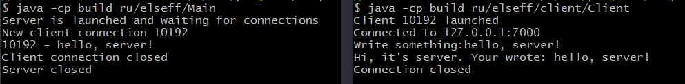
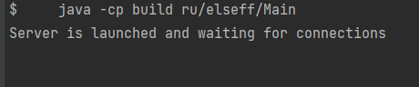
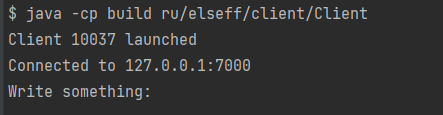

#Client-Server Application

* Single threaded version



###For launch
You need to launch the server and after it launch client in new terminal instance \
```
    javac -d build -cp src src/ru/elseff/*java
    javac -d build src/ru/elseff/client/Client.java
    java -cp build ru/elseff/Main
```
 \
You need to launch client in new terminal instance
```
    java -d build ru/elseff/client/Client
```

