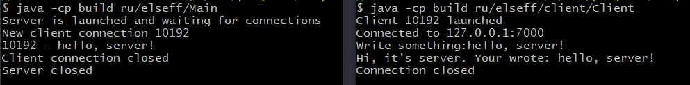
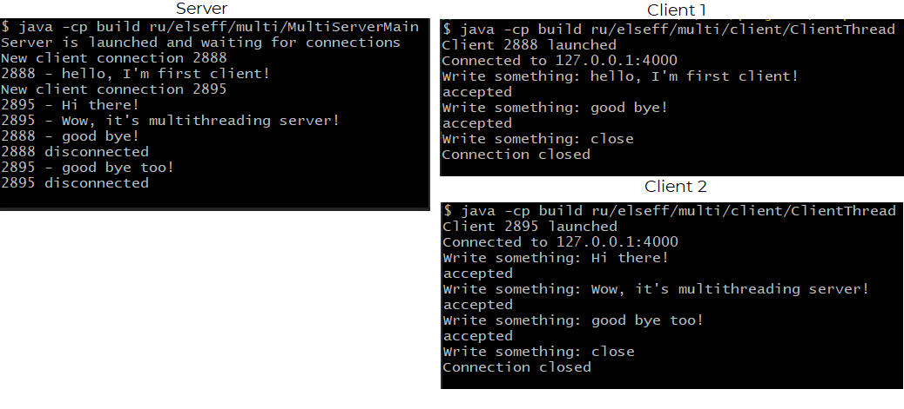

# Client-Server Application
* Single threading version \
    The server is running and waiting for someone to try to connect to it. It accepts the connection request and starts talking to the client. The server can communicate with only one client.
* Multithreading version \
    The server is running and waiting for someone to try to connect to it. It accepts the connection request and starts communicating with the client. Multiple clients can communicate with the server at the same time

> Preview 
    Single threading

    Multi threading


### For launch

* <b>Single threading version </b>
  
  You need to launch the server and after it launch client in new terminal instance 
    ```
        javac -d build -cp src src/ru/elseff/single/*java
        javac -d build src/ru/elseff/single/client/Client.java
        java -cp build ru/elseff/single/Main
    ```
    You need to launch client in new terminal instance
    ```
        java -d build ru/elseff/single/client/Client
    ```

* <b> Multi threading version </b>

    You need to launch the server and after it launch client in new terminal instance 

    ```
        javac -d build -cp src src/ru/elseff/multi/*.java
        javac -d build -cp src src/ru/elseff/multi/client/ClientThread.java
        java -cp build ru/elseff/multi/MultiServer
    ```
    You need to launch clients in new terminal instances
    ```
        java -cp build ru/elseff/multi/client/ClientThread
    ```
